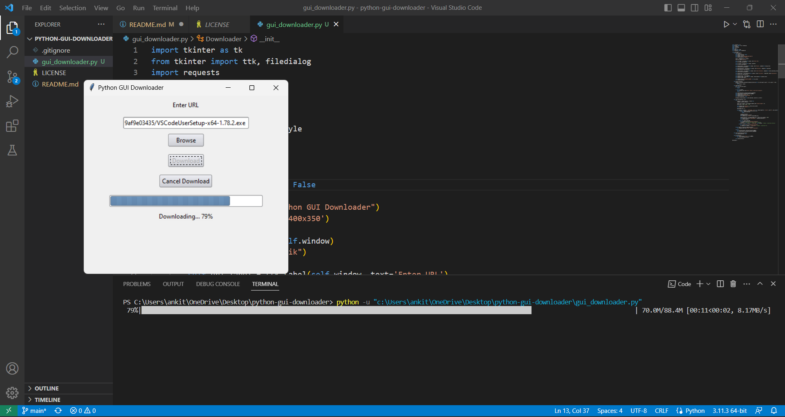

# Python GUI Downloader

This is a Python GUI application that allows you to download files from a given URL using a graphical user interface (GUI). It provides a convenient way to select the URL and the save location for the downloaded file.


## Features

- User-friendly GUI for downloading files
- Ability to enter the URL of the file to be downloaded
- Option to browse and select the save location for the downloaded file
- Progress bar to track the download progress
- Real-time progress text updates during the download process
- Download cancellation functionality
- Responsive and intuitive interface

## Dependencies

This application requires the following dependencies to be installed:

- `tkinter`: The standard Python interface to the Tk GUI toolkit.
- `requests`: A Python library for making HTTP requests.
- `threading`: A Python module for working with threads.
- `os`: A Python module for interacting with the operating system.
- `shutil`: A Python module for high-level file operations.
- `tqdm`: A Python library for creating progress bars.
- `ttkthemes`: A Python library for providing themed widgets using the Tkinter ttk module.

You can install these dependencies using the `pip` package manager. For example:

```
pip install tkinter requests tqdm ttkthemes
```

## Usage

1. Clone or download the repository to your local machine.

2. Open the terminal or command prompt and navigate to the project directory.

3. Run the following command to start the application:

```py
python gui_downloader.py
```

4. The GUI window will appear, allowing you to interact with the application.

5. Enter the URL of the file you want to download in the provided text field.

6. Click the "Browse" button to select the save location for the downloaded file.

7. Click the "Download" button to start the download process.

8. The progress bar will show the download progress, and the progress text will provide real-time updates.

9. To cancel the download, click the "Cancel Download" button.

10. Once the download is complete, the progress text will indicate the completion status, and the downloaded file will be saved in the specified location.

11. Close the application window to exit the program.

## License

This project is licensed under the [MIT License](LICENSE). Feel free to modify and use it according to your needs.

## Acknowledgments

- This application utilizes the following open-source libraries: `requests`, `threading`, `os`, `shutil`, `tqdm`, and `ttkthemes`.